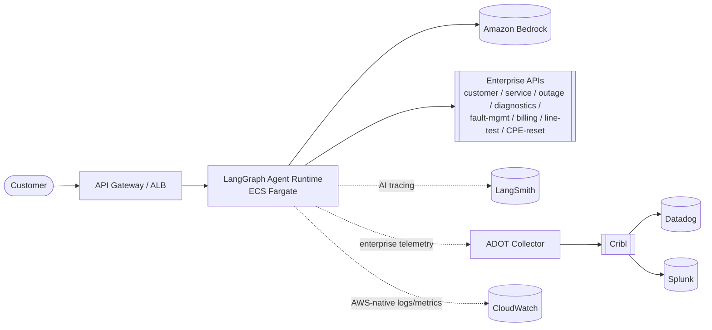
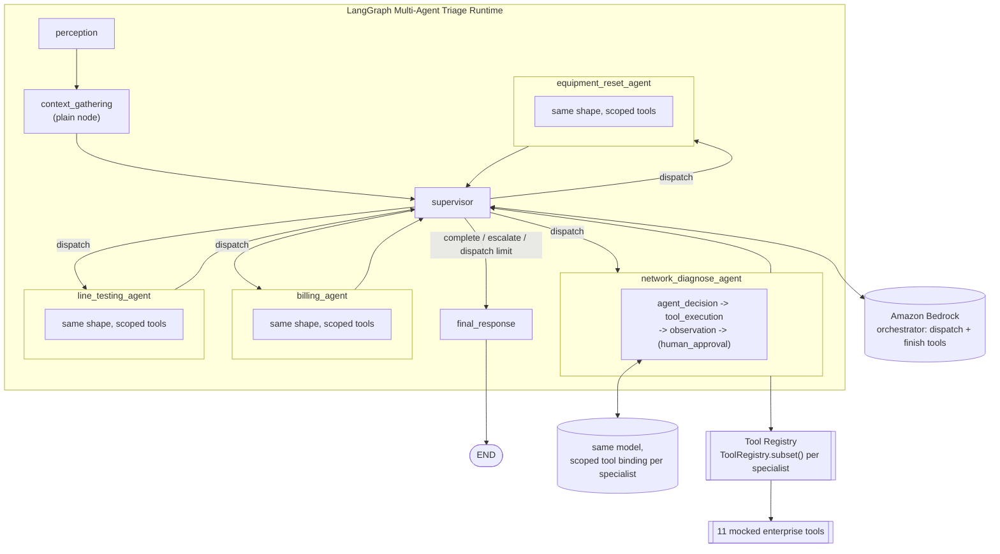
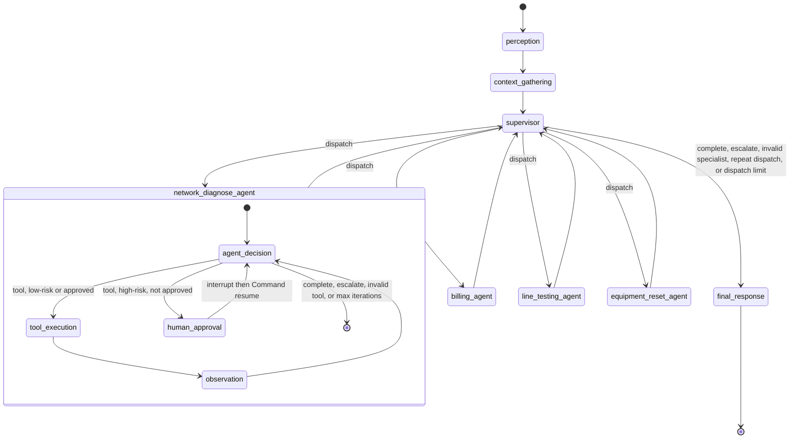
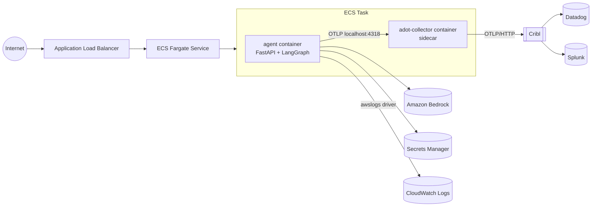
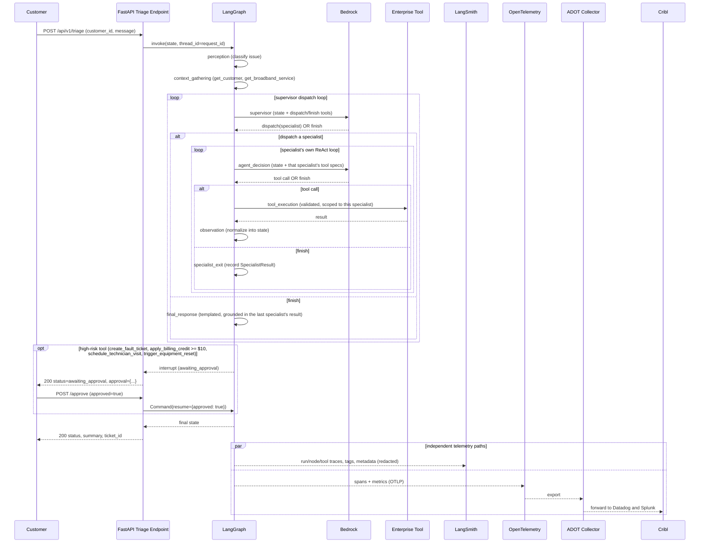

# Architecture

## 1. Context diagram

Two observability paths leave the agent, and they never merge:
**LangSmith** (AI-specific run/evaluation tracing) and **OpenTelemetry ->
ADOT -> Cribl -> Datadog/Splunk** (vendor-neutral enterprise telemetry).
**CloudWatch** is a third, AWS-native path fed directly by ECS/AWS, not by
the OTel pipeline. See [observability.md](observability.md) for the full
rationale.

## 2. Logical architecture

The graph (state machine structure, allowed transitions, which tools each
specialist can even see, where the human-approval boundary sits) is fixed
by LangGraph. The **orchestrator policy** plugged into `supervisor`
(Bedrock in production, a rule-based mock for local/CI use) chooses which
specialist to dispatch; each specialist's own **decision policy** chooses
its next tool call -- see [agent-design.md](agent-design.md).

## 3. LangGraph state graph

`billing_agent`/`line_testing_agent`/`equipment_reset_agent` share the
exact same internal shape as `network_diagnose_agent` (one generic
subgraph builder, `specialist_graph.py::build_specialist_subgraph`,
instantiated four times over different scoped tools/policies) -- omitted
above for brevity.

## 4. Physical deployment diagram

See [deployment.md](deployment.md) for the Terraform that provisions this
(`infra/`) and the container image (`docker/Dockerfile`).

## 5. Sequence diagram

LangSmith and OpenTelemetry are emitted independently and never depend on
each other -- disabling either one does not affect the customer-facing
response or the other pipeline.

## 6. Observability architecture

See [observability.md](observability.md) for the full write-up. Summary:

| Concern | System | Notes |
|---|---|---|
| Agent run/node/LLM/tool traces, evaluation | **LangSmith** | AI-specific; gated by `LANGCHAIN_TRACING_V2` |
| Vendor-neutral traces/metrics/logs | **OpenTelemetry -> ADOT -> Cribl -> Datadog/Splunk** | Enterprise pipeline; gated by `OTEL_ENABLED` |
| AWS-native container/app logs, ECS/ALB metrics, alarms | **CloudWatch** | Fed directly by ECS `awslogs` driver + native AWS metrics, not via OTel |

## 7. Security architecture

See [security.md](security.md) for the full write-up. Summary: an explicit,
per-specialist-scoped tool allow-list is the actual enforcement boundary
(not prompt wording -- see `ToolRegistry.subset()` in
[agent-design.md](agent-design.md)), a human-approval interrupt gates every
high-risk action (four unconditional, one conditional on a dollar
threshold), and PII is redacted before it reaches LangSmith or structured
logs.

## Known limitations

- **Multi-agent redesign exercised against live Bedrock locally (not yet
  redeployed to ECS)**: the supervisor pattern (`docs/agent-design.md`) --
  `BedrockOrchestratorPolicy` plus four scoped `BedrockDecisionPolicy`
  instances -- correctly routes a chained network_diagnose -> billing
  investigation through both approvals against the live model, consistently
  across repeated runs.
- **A confirmed LangGraph replay behavior (once any specialist subgraph
  executes, earlier plain nodes/specialists in the same investigation get
  re-invoked for real) initially had a live-model-specific consequence, not
  just a cosmetic one -- since fixed.** Replaying a *decision* call is
  different for a live LLM than for the deterministic mock: re-asking the
  same question isn't guaranteed to get the same answer twice, and this was
  confirmed live to cause an extra, unintended specialist dispatch after a
  chained investigation's second approval, silently overriding the correct
  final resolution. Fixed with two guards working together: `state.py`'s
  `dedup_add` reducer keeps every accumulating list (`tool_results`,
  `specialist_history`, ...) byte-identical across a replay instead of
  growing duplicate entries, and `models/decision_cache.py` caches each
  decision policy's answer keyed on that now-stable state, reusing it
  instead of re-invoking the (possibly live-LLM-backed) policy. See
  [agent-design.md](agent-design.md)'s "Interrupt replay and idempotency"
  for the full mechanism and why the dedup guard had to come first (a naive
  decision cache alone doesn't work, since without it the cache key itself
  drifts across the replay).
- `BedrockDecisionPolicy` (`agent/src/agent/models/bedrock.py`) has since
  been exercised against a live Bedrock model (`au.anthropic.claude-haiku-
  4-5-20251001-v1:0` in `ap-southeast-2`, via a cross-region inference
  profile) -- both locally and deployed to ECS Fargate, covering all four
  diagnostic paths including the human-approval pause/resume. This caught
  and fixed two real bugs the mock policy couldn't surface: (1)
  `build_decision_messages` never included `customer_id` in the model's
  context, so the live policy had no way to identify which customer to
  investigate; (2) the IAM task-role policy only granted the foundation-model
  ARN form, not the inference-profile ARN + underlying per-region model ARNs
  a cross-region profile actually needs (`AccessDeniedException` on
  `bedrock:InvokeModel` despite the model being invocable). `MockDecisionPolicy`
  is still what automated tests exercise (`MOCK_MODE=true`, the default) --
  see [README.md](../README.md#running-against-amazon-bedrock) for the setup.
- `infra/` has since been `terraform apply`'d against a real AWS account
  (default VPC, no NAT gateway -- `assign_public_ip = true` on the ECS
  service instead) and confirmed serving live traffic through the ALB. See
  [README.md](../README.md#deploying-to-aws-ecs-fargate) and
  [deployment.md#known-limitations](deployment.md#known-limitations).
- LangSmith tracing is now exercised end-to-end (traces confirmed landing
  via the `langsmith` CLI against a live deployment). Root cause of the
  `403 Forbidden` every request initially got: **LangSmith is multi-region**
  and a key only authenticates against the region its account is hosted in
  (here, APAC) -- the default US API host (and every plausible workspace-
  scoping header tried) rejected it identically regardless of key type
  (Personal Access Token) or freshness, which made it look like an
  account/permission problem rather than a wrong hostname. Fixed by setting
  `LANGCHAIN_ENDPOINT` (`langsmith_endpoint` in Terraform) to the account's
  actual regional host -- see [README.md](../README.md#optional----langsmith-tracing).
  The Cribl/Datadog/Splunk pipeline is still not exercised against a real
  endpoint (no real Cribl instance in a personal account) -- the OTLP code
  path is otherwise validated against a local OTel Collector
  (`docker/docker-compose.yml`).
