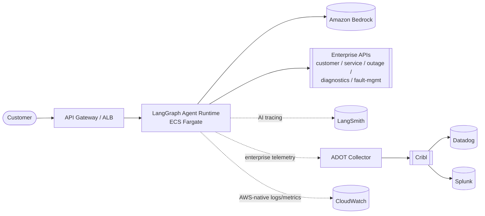
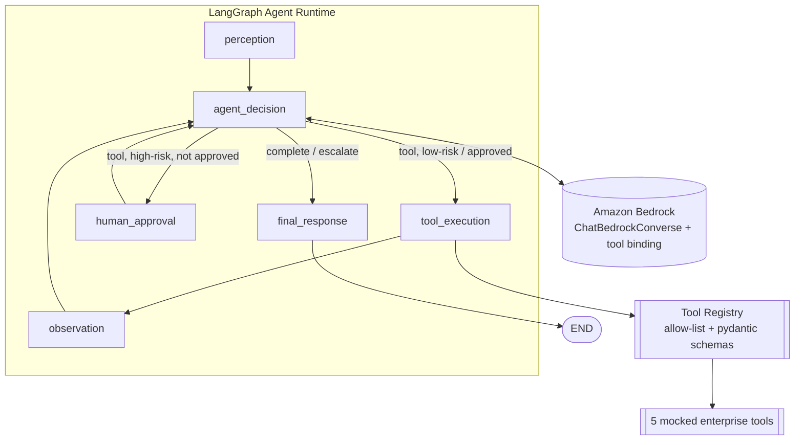
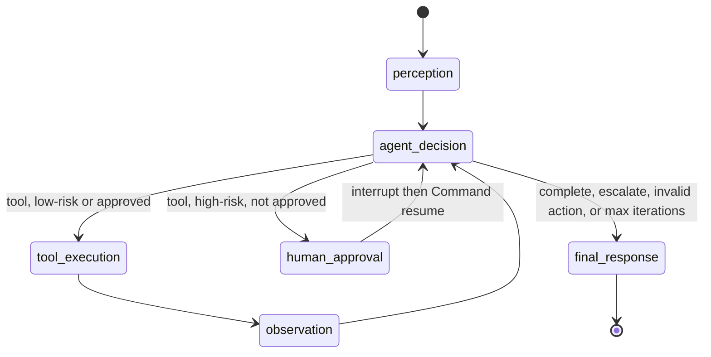
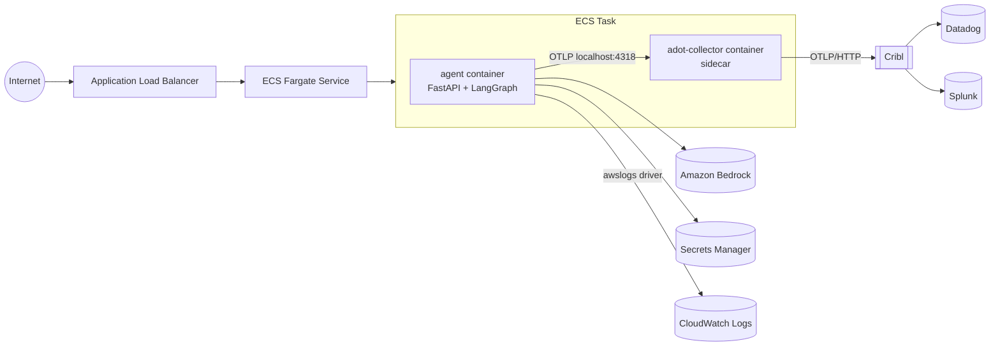
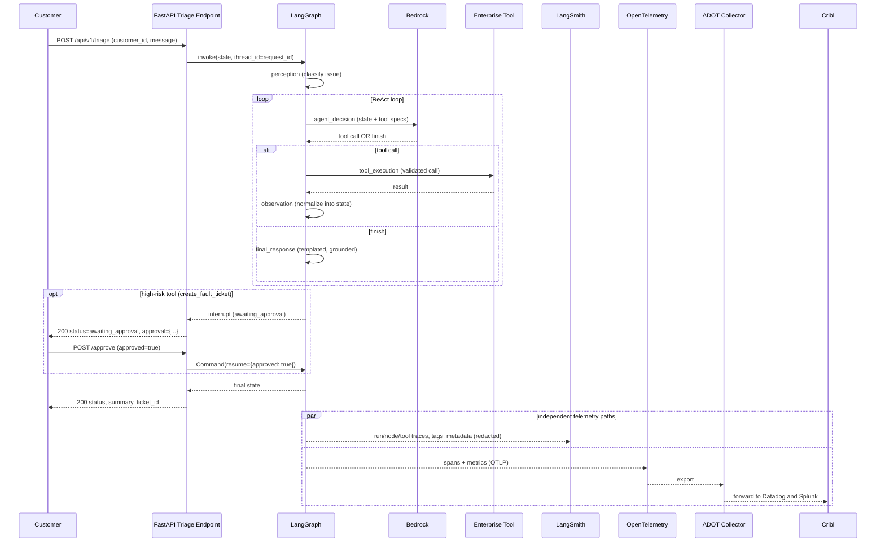

# Architecture

## 1. Context diagram

Two observability paths leave the agent, and they never merge:
**LangSmith** (AI-specific run/evaluation tracing) and **OpenTelemetry ->
ADOT -> Cribl -> Datadog/Splunk** (vendor-neutral enterprise telemetry).
**CloudWatch** is a third, AWS-native path fed directly by ECS/AWS, not by
the OTel pipeline. See [observability.md](observability.md) for the full
rationale.

## 2. Logical architecture

The graph (state machine structure, allowed transitions, the human-approval
boundary) is fixed by LangGraph. The **decision policy** plugged into
`agent_decision` (Bedrock in production, a rule-based mock for local/CI use)
is what actually chooses the next action at runtime from the current
`AgentState.observations` -- see [agent-design.md](agent-design.md).

## 3. LangGraph state graph

## 4. Physical deployment diagram

See [deployment.md](deployment.md) for the Terraform that provisions this
(`infra/`) and the container image (`docker/Dockerfile`).

## 5. Sequence diagram

LangSmith and OpenTelemetry are emitted independently and never depend on
each other -- disabling either one does not affect the customer-facing
response or the other pipeline.

## 6. Observability architecture

See [observability.md](observability.md) for the full write-up. Summary:

| Concern | System | Notes |
|---|---|---|
| Agent run/node/LLM/tool traces, evaluation | **LangSmith** | AI-specific; gated by `LANGCHAIN_TRACING_V2` |
| Vendor-neutral traces/metrics/logs | **OpenTelemetry -> ADOT -> Cribl -> Datadog/Splunk** | Enterprise pipeline; gated by `OTEL_ENABLED` |
| AWS-native container/app logs, ECS/ALB metrics, alarms | **CloudWatch** | Fed directly by ECS `awslogs` driver + native AWS metrics, not via OTel |

## 7. Security architecture

See [security.md](security.md) for the full write-up. Summary: an explicit
tool allow-list is the actual enforcement boundary (not prompt wording), a
human-approval interrupt gates the one high-risk action, and PII is redacted
before it reaches LangSmith or structured logs.

## Known limitations

- This environment had no AWS credentials and no Bedrock model access:
  `BedrockDecisionPolicy` (`agent/src/agent/models/bedrock.py`) is implemented
  against the documented LangChain/Bedrock tool-calling contract and its
  response-parsing logic is unit-tested, but it has **not been exercised
  against a live Bedrock model**. `MockDecisionPolicy` is what all local runs
  and automated tests exercise (`MOCK_MODE=true`, the default).
- LangSmith and the Cribl/Datadog/Splunk pipeline were not exercised against
  real endpoints for the same reason; the OTLP/LangSmith integration code
  paths are real, but only validated with `OTEL_ENABLED`/`LANGCHAIN_TRACING_V2`
  toggled off, plus a local OTel Collector with a `logging` exporter
  (`docker/docker-compose.yml`).
- `infra/` was validated with `terraform validate`/`terraform fmt` only --
  it has not been applied against a real AWS account (no credentials/VPC
  available here).
