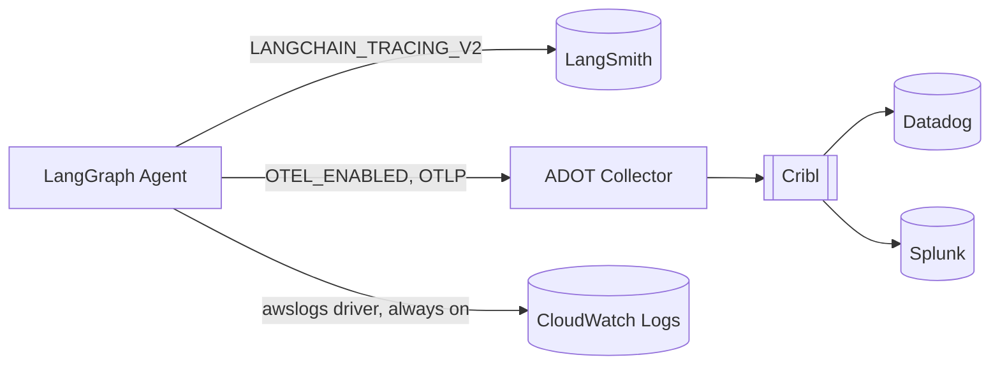

# Observability

Three independent paths leave the agent. None of them depends on another
being enabled.

## 1. LangSmith -- AI-specific tracing & evaluation

`agent/src/agent/observability/langsmith.py` builds redacted tags/metadata
(`build_run_config`) for LangSmith runs. Actual tracing is controlled by the
standard `LANGCHAIN_TRACING_V2` / `LANGCHAIN_API_KEY` / `LANGCHAIN_PROJECT`
env vars, which LangChain reads directly -- this module only shapes what
gets attached, so raw customer text and PII never reach LangSmith. Tags
attached to every run: `environment:<env>`, `application:broadband-triage-agent`,
`use_case:customer_service`, `agent_version:<version>`.

LangSmith captures: agent runs, node execution, LLM calls, tool calls,
latency, token usage (where the Bedrock integration surfaces it), and the
full agent trajectory for evaluation. **It is not the enterprise logging
system** -- see below for that.

## 2. OpenTelemetry -- vendor-neutral enterprise telemetry

`agent/src/agent/observability/telemetry.py` owns:

- **Traces**: `traced_step`/`traced_node` wrap every LangGraph node
  (`node.<name>` spans) and every tool call (`tool.<name>` spans, which
  are also the "enterprise API call" spans in this POC, since the tools
  *are* the enterprise API integration point). Since the multi-agent
  redesign, each specialist's internal nodes are prefixed with its own name
  (`node.network_diagnose.agent_decision`, `node.billing.observation`, ...)
  so five subgraphs' worth of spans stay distinguishable in one trace --
  see `specialist_graph.py`. `context_gathering` (a plain node, not a
  subgraph) is deliberately **not** `traced_node`-wrapped at its own
  call site -- it internally calls already-spanned `tool_execution` work,
  and empirically, wrapping it in an *additional* outer span caused its
  real work to execute twice (see `agent-design.md`'s "Interrupt replay
  and idempotency"); its two tool calls still each get their own
  `tool.<name>` span from `tool_execution` itself. `main.py` adds an
  `langgraph.execution` span around the whole graph invocation, and
  `instrument_fastapi_app` adds standard HTTP spans via
  `FastAPIInstrumentor` when `OTEL_ENABLED=true`.
- **Metrics**: `triage.request.count`, `triage.request.duration_ms`,
  `triage.tool.duration_ms`, `triage.error.count`,
  `triage.agent.duration_ms`.
- **Logs**: `observability/logging.py` configures structured JSON logs on
  stdout with `correlation_id`/`trace_id` on every record (see
  Correlation below). This is a separate, always-on concern from OTel
  logs export.

`OTEL_ENABLED` gates only whether a real OTLP exporter/provider is wired up
(`setup_telemetry`) -- span/metric-recording code always runs, against a
safe no-op tracer when disabled, so toggling the flag never changes control
flow (`tests/test_observability.py`).

In AWS, `OTEL_EXPORTER_OTLP_ENDPOINT` points at `http://localhost:4318`,
resolved inside the ECS task to the **ADOT Collector sidecar**
(`infra/modules/ecs_fargate`), which forwards to **Cribl**
(`otlphttp/cribl` exporter, `infra/modules/ecs_fargate/templates/adot-config.yaml.tpl`).
Cribl fans out to **Datadog** and **Splunk**. The application never talks to
Datadog or Splunk directly, and never needs vendor-specific SDKs -- only
OTLP to the collector. Locally, `docker/docker-compose.yml` runs an
`otel/opentelemetry-collector-contrib` container with a `logging` exporter
(`docker/otel-collector-config.yaml`) so the whole pipeline is exercisable
without a real Cribl endpoint.

## 3. CloudWatch -- AWS-native path (separate from OTel)

The ECS task's `agent` and `adot-collector` containers both use the
`awslogs` log driver straight to a CloudWatch Logs group
(`infra/modules/ecs_fargate/main.tf`) -- this is independent of whether
`OTEL_ENABLED` is set. CloudWatch also receives native ECS/ALB metrics
(CPU, 5xx count), which back the two alarms in
`infra/modules/cloudwatch`. **CloudWatch is not an OTel export target in
this design** -- per the spec, the two paths (`Application -> OTel -> ADOT
-> Cribl -> Datadog/Splunk` and `AWS/ECS -> CloudWatch`) are kept separate
rather than assuming OTel data must also land in CloudWatch.

## Correlation

Every `/api/v1/triage` request gets a `request_id` (`REQ-XXXXXXXX`, also
used as the LangGraph checkpointer's `thread_id`) and a `trace_id`
(`main.py::triage`). `set_correlation_context` puts both into a
`contextvars`-backed filter so every structured log line carries them, and
they're attached as span attributes on the `langgraph.execution` span. This
is what lets a support engineer correlate a single customer request across
CloudWatch, Datadog/Splunk (via the OTel span attributes), and LangSmith
(via the `request_id` in run metadata) without any of those systems being
directly aware of each other.

## PII

See [security.md](security.md) for the redaction rules
(`security/redaction.py`) applied before anything reaches LangSmith
metadata or the approval payload returned to API callers.
